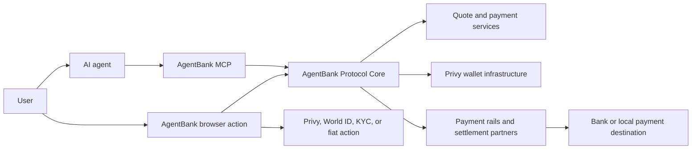

# AgentBank Mintlify Documentation Specification

Status: Final implementation brief for documentation and engineering review  
Target platform: Mintlify  
Target repository: `trunghuynh-humanfx/agentbank-docs`
Public repository URL: `https://github.com/trunghuynh-humanfx/agentbank-docs`
Last updated: 2026-07-29

## 1. Purpose

This specification defines the public AgentBank documentation to be published
with Mintlify. It borrows the strongest documentation patterns from AgentCard
and Sponge Wallet while reflecting AgentBank's actual product model:

- AgentBank provides banking-like services to AI agents and connects AI to the
  global banking system.
- AgentBank has no public AgentBank CLI. Users connect an MCP server and install
  or load an agent skill.
- A human owns and authorizes the AgentBank account. An authorized agent can use
  the account and its bound wallet within the permissions and approval policy
  granted by the human.
- AgentBank does not hold custody of the user's wallet. Privy supplies the
  wallet infrastructure.
- World ID is used for unique-human attestation and payment approvals.
- World AgentKit verification can make an eligible verified agent's wallet
  eligible for sponsored gas.
- The public MCP surface contains the 33 tools defined in the official AgentBank
  MCP specification.

This file is a content and implementation specification, not a substitute for
the official MCP contract.

## 2. Source-of-truth hierarchy

When sources disagree, documentation writers must use this order:

1. Deployed AgentBank behavior in the selected environment.
2. `agentbank-mcp-specification(1).md` for the public MCP contract.
3. `agentbank-SKILL.md` for agent workflow and safety behavior.
4. This documentation specification for structure, positioning, and planned
   product behavior.
5. AgentCard and Sponge materials only as structural references.

Do not copy AgentCard or Sponge product claims, commands, authentication,
amount conventions, tool names, or custody language into AgentBank docs.

## 3. Confirmed product facts

### 3.1 Brand and positioning

- Public name: AgentBank.
- Public description: "Banking-like services for AI agents. Connect AI to the
  global banking system."
- Replace public HumanFX and HFX product branding with AgentBank. The confirmed
  `trunghuynh-humanfx/agentbank-docs` GitHub coordinate is a repository
  identifier, not product
  branding.
- Retain the following compatibility environment variable names exactly:
  - `HFX_AGENT_CREDENTIAL`
  - `HFX_MCP_PROFILE`
- Use "browser authorization" as the public term for the account connection
  flow.
- The browser page heading is "Connect to your AgentBank Account."

### 3.2 Environments

| Environment | App URL | Protocol URL | Funding model |
| --- | --- | --- | --- |
| Staging | `https://staging.agentbank.world` | `https://protocol.agentbank.world` | A supported on-ramp automatically succeeds and credits mock tokens |
| Production | `https://app.agentbank.world` | `https://protocol.agentbank.world` | Live supported payment routes |

AgentBank does not currently have an in-product test-mode switch. Staging and
production must be presented as separate MCP configurations. Do not use
"switch to test mode" language.

The staging funding flow is:

1. Ask the agent to discover a currently supported staging on-ramp.
2. Create and continue that on-ramp through the normal AgentBank payment flow.
3. The staging on-ramp automatically succeeds; no real bank transfer or manual
   fiat payment is required.
4. AgentBank credits mock tokens to the staging AgentBank wallet.
5. The user can then start another on-ramp or exercise any other payment intent
   currently supported by staging with those mock tokens.

Do not describe a faucet, test-mode switch, fake bank account, or manual
simulation control. The normal on-ramp flow is the staging funding mechanism.

### 3.3 Hosted AgentBank agent

- Users can open `https://app.agentbank.world`, sign in, and chat directly with
  the AgentBank-hosted agent.
- The hosted flow does not require the user to connect an external AI agent,
  configure MCP, or install the AgentBank Pay skill.
- The Introduction page must present the hosted agent as a direct way to use
  AgentBank, while the getting-started guides cover connecting the user's own
  agent.

### 3.4 Supported agent clients

The initial docs must cover:

- Codex
- Claude Code
- Claude Desktop
- OpenClaw
- Hermes Agent

### 3.5 Authentication and account control

- The normal onboarding flow opens browser authorization.
- The account is tied to the user's login.
- Only the logged-in user and an agent authorized by that user can operate the
  bound wallet through AgentBank.
- Privy provides wallet infrastructure and delegated wallet authorization.
- The MCP stores the local agent installation credential and Privy device
  authorization material without exposing it through tool results.
- The agent must never request a private key, seed phrase, AgentBank session
  token, Privy token, authorization key, or World ID proof.

### 3.6 Current collection behavior

"Collect money" may mean any of the following:

1. Add money to the user's own AgentBank wallet.
2. Collect a payment from a customer.
3. Receive fiat as crypto.

The payer may be someone other than the AgentBank account owner. Until payment
links are released, the agent may provide the payer with the order-specific
bank account details or QR instructions returned by AgentBank. The agent can
track whether the order was paid, but cannot identify who paid it.

Shareable, single-payment payment links must be labeled "Coming soon." Do not
describe them as an available tool or current workflow.

### 3.7 Support

- Email: `support@agentbank.world`
- Telegram: `https://t.me/+MxUewVNlzSplY2Y1`

## 4. Confirmed naming and autonomy behavior

### 4.1 Configurable autonomous-payment threshold

The confirmed product policy is:

- The account owner configures the threshold on
  `https://app.agentbank.world`.
- The threshold is a platform setting, not an MCP configuration command.
- A payment below the configured threshold may be transacted automatically by
  the authorized agent within its granted permissions.
- A payment above the threshold requires World ID attestation.
- The threshold does not bypass recipient validation, route validation, balance
  checks, scope checks, idempotency, or Core-owned payment instructions.
- The user can return to the AgentBank platform to change the threshold or
  revoke the connected agent.

Do not present USD 10 as the permanent public rule. The supplied MCP and skill
still describe a fixed USD 10 bypass and explicit confirmation flags. Treat
that wording as a source migration issue: the deployed platform, MCP, and skill
must agree before publication. Tool-reference pages must still reproduce the
exact deployed schemas, while user guides describe the configured platform
threshold and server-enforced authorization result.

The threshold page may link to the AgentBank platform, but it must not invent a
settings menu name, URL path, default, minimum, maximum, or conversion formula
until those values are supplied by the platform.

### 4.2 Resource and field naming

The public naming requested for the next AgentBank release is:

- Prompt: `agentbank_routing_guide`
- Fixed resource: `agentbank://guides/routing`
- Journey template: `agentbank://instructions/{journey}`
- Onboarding claim field: `agentbank_claimed`

The existing MCP and skill still use `humanfx_*` compatibility identifiers in
some places. Public guides use the AgentBank names. Exact legacy identifiers may
appear only in a clearly labeled compatibility note until the deployed server
and skill complete the naming migration.

## 5. Documentation audiences

Every page must be written for one primary audience and labeled through its
title, introduction, and navigation placement.

### 5.1 Account owners and operators

They need to understand:

- what AgentBank does;
- what the agent can do;
- how browser authorization works;
- how the wallet and non-custodial control model work;
- when KYC, World ID, AgentKit, or a manual fiat action is required;
- what they are confirming;
- how to set or revoke agent authority;
- how to track, cancel, correct, or recover a payment;
- what AgentBank can and cannot determine about a payer.

### 5.2 Agent users and builders

They need to understand:

- how to connect the MCP in their selected client;
- how to install or load the AgentBank skill;
- how to verify the tools are available;
- the intended tool sequence for each journey;
- amount, asset, request-ID, confirmation, and status rules;
- which server result is authoritative;
- the limitations of the current public surface.

### 5.3 AI agents

The skill and MCP resources must teach agents to:

- check readiness before starting a financial action;
- preserve the user's original task through browser authorization;
- use AgentBank MCP tools rather than direct HTTP requests or constructed
  transaction payloads;
- obtain the required confirmation without repeatedly asking for the same
  approval;
- show full amounts, fees, routes, recipients, and expiry before commitment;
- use stable idempotency request IDs;
- execute only current Core-generated instructions;
- rely on `get_payment`, not a transaction hash, for payment completion;
- recover safely without duplicating a transfer.

## 6. Writing and UX principles

### 6.1 Lead with intent, then explain tools

The primary navigation should use user goals such as "Send money," "Collect
money," "Add funds," and "Track a payment." Tool names belong in workflow
steps and the reference section, not as the main learning path.

### 6.2 Separate human actions from agent actions

Use explicit labels:

- **You:** browser authorization, KYC, World ID, bank transfer, QR payment, or
  confirmation.
- **Your agent:** quotes, recipient validation, durable payment creation,
  wallet execution, polling, and recovery.
- **AgentBank:** route locking, approval state, payment instructions,
  transaction verification, and durable payment state.

### 6.3 Explain why a step exists

Keep rationale short and near the relevant step. Examples:

- "Confirming the full summary prevents the agent from committing a different
  recipient, amount, or route."
- "Use the same request ID when retrying so AgentBank does not create a second
  payment."
- "A transaction receipt proves an on-chain step, not final bank delivery."

### 6.4 Never overstate capability

The docs must say clearly:

- payment links are not available yet;
- staging is not a test-mode toggle;
- the agent can see whether an order was paid but not who paid it;
- partner identity is intentionally hidden;
- a two-hop payment is not complete when only one hop completes;
- no generic arbitrary EVM transaction tool exists;
- estimates are temporary and have no estimate ID;
- recipient QR decoding does not perform OCR on text-only screenshots;
- cancellation, correction, and approval refresh have state-dependent limits.

### 6.5 Use examples that match the contract

- Human amounts must be decimal strings in JSON examples.
- Fiat assets use `{ "type": "fiat", "symbol": "VND" }`.
- Crypto assets use
  `{ "type": "crypto", "ticker": "USDC", "chain": "worldchain" }`.
- Do not add a chain to fiat assets.
- Do not invent token addresses, decimals, bank fields, recipient fields,
  calldata, or partner names.

### 6.6 Public writing style

Use direct technical English, short paragraphs, task-first headings, concrete
verbs, and consistent AgentBank terminology. Use "AI agent" on first mention
and "agent" afterward. Prefer "user" or "account owner" in public prose.

Decision guides must publish observable checks, decision tables, flowcharts,
prerequisites, and safe next actions. Do not publish hidden chain-of-thought or
private reasoning traces. Use labels such as "Agent checks," "Agent action,"
and "User action."

Avoid vague superlatives, guaranteed speed, guaranteed best price, guaranteed
gas sponsorship, or "fully autonomous" without explaining the configured
threshold and granted permissions.

## 7. Mintlify repository structure

Create the documentation in `trunghuynh-humanfx/agentbank-docs` with this layout:

```text
.
|-- docs.json
|-- README.md
|-- index.mdx
|-- introduction/
|   |-- overview.mdx
|   |-- why-agentbank.mdx
|   |-- architecture.mdx
|   |-- core-concepts.mdx
|-- getting-started/
|   |-- quickstart.mdx
|   |-- environment.mdx
|   |-- connect-your-agent.mdx
|   |-- authentication.mdx
|   |-- install-the-skill.mdx
|   |-- first-payment.mdx
|-- money-in/
|   |-- overview.mdx
|   |-- add-money.mdx
|   |-- collect-from-a-payer.mdx
|   |-- receive-fiat-as-crypto.mdx
|-- money-out/
|   |-- overview.mdx
|   |-- bank-payout.mdx
|   |-- crypto-to-fiat.mdx
|   |-- manage-recipients.mdx
|-- exchange/
|   |-- overview.mdx
|   |-- quotes-and-rates.mdx
|   |-- same-chain-swaps.mdx
|   |-- fiat-to-fiat.mdx
|-- payments/
|   |-- overview.mdx
|   |-- payment-lifecycle.mdx
|   |-- track-payments.mdx
|   |-- cancel-or-correct.mdx
|   |-- recover-failures.mdx
|-- autonomy/
|   |-- overview.mdx
|   |-- configure-thresholds.mdx
|   |-- world-id-approval.mdx
|   |-- kyc.mdx
|   |-- agentkit-and-gas.mdx
|-- ai-guides/
|   |-- instructions-for-your-agent.mdx
|   |-- payment-decision-guide.mdx
|   |-- confirmation-rules.mdx
|   |-- recipient-rules.mdx
|   |-- routing-strategy.mdx
|   |-- conversation-patterns.mdx
|   |-- safety-and-recovery.mdx
|-- reference/
|   |-- mcp-overview.mdx
|   |-- configuration.mdx
|   |-- resources.mdx
|   |-- tools/
|   |   |-- overview.mdx
|   |   |-- begin-agent-onboarding.mdx
|   |   |-- wait-for-agent-onboarding.mdx
|   |   |-- get-installation-status.mdx
|   |   |-- revoke-agent.mdx
|   |   |-- whoami.mdx
|   |   |-- check-verification-status.mdx
|   |   |-- do-kyc.mdx
|   |   |-- get-verification-guidance.mdx
|   |   |-- check-my-scopes.mdx
|   |   |-- list-currencies.mdx
|   |   |-- list-quote-book-pairs.mdx
|   |   |-- browse-quote-book.mdx
|   |   |-- get-ramp-quote.mdx
|   |   |-- get-instructions.mdx
|   |   |-- get-account-status.mdx
|   |   |-- estimate-payment.mdx
|   |   |-- create-payment.mdx
|   |   |-- continue-payment.mdx
|   |   |-- execute-payment-instruction.mdx
|   |   |-- get-wallet-balances.mdx
|   |   |-- get-token-allowance.mdx
|   |   |-- approve-token.mdx
|   |   |-- get-transaction-receipt.mdx
|   |   |-- get-payment.mdx
|   |   |-- list-payments.mdx
|   |   |-- cancel-payment.mdx
|   |   |-- correct-payment-recipient.mdx
|   |   |-- list-recipients.mdx
|   |   |-- get-recipient.mdx
|   |   |-- create-recipient.mdx
|   |   |-- update-recipient.mdx
|   |   |-- list-wallets.mdx
|   |   `-- verify-agent-kit.mdx
|   |-- scopes.mdx
|   |-- idempotency.mdx
|   |-- errors.mdx
|   |-- statuses.mdx
|   |-- limitations.mdx
|-- security/
|   |-- security-model.mdx
|   |-- account-revocation.mdx
|   |-- responsible-agent-use.mdx
|-- support/
|   |-- troubleshooting.mdx
|   |-- faq.mdx
|   `-- contact.mdx
|-- changelog.mdx
|-- skills/
|   |-- agentbank-pay/
|       |-- SKILL.md
|-- snippets/
|-- images/
```

The public AgentBank skill is distributed from
`https://github.com/theagentbank/skills` and from the stable protocol URL.

### 7.1 Navigation groups

Recommended Mintlify navigation:

1. Introduction
2. Overview
3. Getting started
4. Money in
5. Money out
6. Exchange
7. Payments
8. Autonomy and human control
9. AI guides
10. MCP reference
11. Security
12. Support

### 7.2 `docs.json` requirements

Create a valid `docs.json` using the Mintlify schema supported by the repository
tooling. It must include:

- product name `AgentBank`;
- site title `AgentBank Docs`;
- navigation in the order above;
- staging link `https://staging.agentbank.world`;
- production link `https://app.agentbank.world`;
- skill link `https://agentbank.world/SKILL.md`;
- GitHub link `https://github.com/theagentbank/skills`;
- email and Telegram support links;
- search and code-copy behavior where supported;
- light and dark theme support;
- no fabricated social, status-page, or community links.

### 7.3 Page frontmatter

Every page must include at least:

```yaml
---
title: "Page title"
description: "One-sentence description written for search and navigation."
---
```

Add icons only after an approved icon strategy exists.

### 7.4 Workflow-page template

Use this structure when applicable:

1. What this does
2. When to use it
3. Before you start
4. How the flow works
5. Instructions for your agent
6. What the user sees
7. Statuses and next actions
8. Failure and recovery behavior
9. Relevant MCP tools
10. Related guides

### 7.5 Tool-reference template

Each MCP tool page must contain:

1. Purpose
2. Authentication and required scopes
3. Mutation and funds-movement behavior
4. When to use it
5. When not to use it
6. Exact input schema
7. Exact output behavior
8. Confirmation requirements
9. Request-ID requirements
10. Statuses and errors
11. Safe retry behavior
12. Source-supported example
13. Related guides

### 7.6 Mintlify components and diagrams

- Use Mintlify `Tabs` for client and environment variants.
- Use `CodeGroup` for staging and production configurations.
- Use `Steps` for browser authorization and payment flows.
- Use `CardGroup` and `Card` for primary task navigation.
- Use `Note` for context and non-blocking caveats.
- Use `Warning` for irreversible actions, real-money behavior, duplicate
  funding risk, and staging/production confusion.
- Use `AccordionGroup` for FAQs and troubleshooting.
- Use `Check` only after an externally verifiable success condition.
- Include "What your agent does" and "What you do" callouts when both parties
  participate.
- Every guide must end with a success condition and a recovery link.
- Every code block must state whether it configures staging or production.
- Use Mermaid for architecture, onboarding, payment lifecycle, direct ramps,
  same-chain swaps, two-hop routes, threshold authorization, and recovery.
- Every diagram must match the current MCP contract and must not imply an
  unsupported service or automatic route planner.

## 8. Required page specifications

### 8.1 Home, overview, and architecture

The home page `index.mdx` must explain AgentBank in seconds and route readers
to the right first action.

Required hero:

> **Give AI agents access to the global banking system.**  
> Collect payments, exchange currencies, and send money to supported bank
> accounts through AgentBank MCP.

Primary actions:

- Get started
- Connect your agent
- Explore payment journeys
- View MCP reference

Required capability cards:

- Collect money
- Send bank payouts
- Exchange currencies and assets
- Manage recipients
- Track durable payments
- Keep users in control

Explain the three-layer model:

- The MCP provides authenticated tools and live state.
- The skill provides operating instructions and safeguards.
- AgentBank Core authorizes routes, owns active instructions, verifies
  execution, and stores durable payment state.

The introduction pages must answer, in this order:

1. What AgentBank is.
2. Who controls the account and wallet.
3. What an authorized agent can do.
4. Which rails and journeys are available through the live MCP.
5. Why users need both the MCP and the skill.
6. Where to start in staging or production.

Suggested opening copy:

> AgentBank provides banking-like services for AI agents. It connects an
> agent authorized by you to supported crypto and fiat payment routes while
> keeping payment state, approvals, and wallet execution under AgentBank's
> verified workflow.

> Your AgentBank wallet is tied to your login. Privy provides the wallet
> infrastructure, and only you and an agent you authorize can operate it
> through AgentBank. Some actions require your confirmation, identity
> verification, or World ID attestation.

Do not use "AI bank," "bank account guaranteed," "insured," "licensed bank,"
or equivalent regulated-status claims without approved product wording.

`introduction/why-agentbank.mdx` must explain:

- AI agents need structured access to fragmented local fiat collection and
  bank payout requirements.
- AgentBank translates supported currencies, recipient fields, eligibility,
  KYC, quotes, settlement, and payment state into high-level MCP journeys.
- The connected agent operates only within granted permissions and the user's
  configured autonomy threshold.

`introduction/architecture.mdx` must use this responsibility model:



The architecture page must clarify that a transaction receipt is not final
payment completion; `get_payment` is authoritative.

### 8.2 Quickstart overview

The quickstart must follow this ladder:

1. Choose staging or production.
2. Connect the AgentBank MCP.
3. Restart or reload the selected client.
4. Install or load the AgentBank skill.
5. Ask the agent to check AgentBank account status.
6. Complete browser authorization when prompted.
7. In staging, on-ramp to receive mock tokens.
8. Ask the agent to show wallet balance and create a first payment.
9. Verify final state with `get_payment`.

Suggested first prompts:

```text
Check whether my AgentBank account and wallet are ready.
```

```text
In AgentBank staging, help me on-ramp to receive mock tokens, then show my balance.
```

```text
Estimate a payment, show me the complete amount, fees, route, recipient, and expiry, and wait for my confirmation before creating it.
```

### 8.3 Staging quickstart

State clearly:

- staging URL: `https://staging.agentbank.world`;
- staging uses the same protocol base URL as the supplied MCP command;
- users obtain mock tokens through a currently supported on-ramp;
- the staging on-ramp automatically succeeds and credits the wallet;
- no payer, real bank transfer, QR payment, or faucet action is required;
- after funding, users may create another on-ramp or use any other intent
  currently supported in staging;
- staging tokens have no real-world monetary value;
- staging is a separate environment, not a mode switch inside production;
- `get_payment` remains authoritative for the automatically completed staging
  payment.

Do not describe a manual faucet, fake bank account, or test-mode control.

### 8.4 Production quickstart

Include a prominent real-money warning. Require the user to review:

- environment URL;
- source and destination assets;
- amount mode;
- fees and fee currencies;
- recipient;
- route and intermediate asset, if any;
- expiry;
- confirmation and World ID requirements.

### 8.5 Browser authorization

Required flow:

1. The agent calls `whoami`.
2. If credentials are missing, it calls `begin_agent_onboarding` once.
3. The agent shows the returned authorization URL.
4. The browser opens "Connect to your AgentBank Account."
5. The user signs in and authorizes the agent installation and bound wallet
   access.
6. The agent waits with `wait_for_agent_onboarding` using the same enrollment
   ID.
7. The agent verifies `agentbank_claimed`, `privy_authorized`, `wallet_bound`,
   and `authenticated`.
8. The agent checks `whoami`, scopes, account status, and wallets.

The page must explain that the user should not paste credentials, wallet keys,
or World ID proof into chat.

### 8.6 Skill overview

Use the AgentCard-style distinction:

- The MCP is the **what**: authenticated tools and current server state.
- The skill is the **how**: workflow order, guardrails, confirmations,
  tracking, and recovery.

The page must say that both are required for the recommended experience. The
skill does not create an account, store money, or replace MCP authentication.

## 9. MCP connection instructions

All client pages must provide staging first, production second, and a short
verification step. The examples below are the approved baseline.

### 9.1 Codex

Staging:

```bash
codex mcp add agentbank \
  --env PROTOCOL_BASE_URL=https://protocol.agentbank.world \
  --env APP_BASE_URL=https://staging.agentbank.world \
  -- npx -y agent-bank-mcp@latest
```

Production:

```bash
codex mcp add agentbank \
  --env PROTOCOL_BASE_URL=https://protocol.agentbank.world \
  --env APP_BASE_URL=https://app.agentbank.world \
  -- npx -y agent-bank-mcp@latest
```

After adding it, restart or reload Codex and ask it to verify that `whoami`,
`get_instructions`, and `begin_agent_onboarding` are available.

### 9.2 Claude Code

Staging:

```bash
claude mcp add -s user agentbank \
  -e PROTOCOL_BASE_URL=https://protocol.agentbank.world \
  -e APP_BASE_URL=https://staging.agentbank.world \
  -- npx -y agent-bank-mcp@latest
```

Production:

```bash
claude mcp add -s user agentbank \
  -e PROTOCOL_BASE_URL=https://protocol.agentbank.world \
  -e APP_BASE_URL=https://app.agentbank.world \
  -- npx -y agent-bank-mcp@latest
```

Explain that `-s user` makes the configuration available across projects. A
project-scoped example may be added if needed, but should not replace the
simple first-run path.

### 9.3 Claude Desktop

On macOS, edit:

```text
~/Library/Application Support/Claude/claude_desktop_config.json
```

Staging configuration:

```json
{
  "mcpServers": {
    "agentbank": {
      "command": "npx",
      "args": ["-y", "agent-bank-mcp@latest"],
      "env": {
        "PROTOCOL_BASE_URL": "https://protocol.agentbank.world",
        "APP_BASE_URL": "https://staging.agentbank.world"
      }
    }
  }
}
```

Production uses the same configuration with:

```json
"APP_BASE_URL": "https://app.agentbank.world"
```

Tell the user to preserve existing `mcpServers` entries, save valid JSON, fully
quit Claude Desktop, and reopen it.

Windows and Linux paths must be added only after checking the current official
Claude Desktop documentation.

### 9.4 OpenClaw

Document the direct configuration because the verified CLI examples do not
establish environment-variable flags for `openclaw mcp add`.

Add the following under `mcp.servers` in `~/.openclaw/openclaw.json`.

Staging:

```json5
{
  mcp: {
    servers: {
      agentbank: {
        command: "npx",
        args: ["-y", "agent-bank-mcp@latest"],
        env: {
          PROTOCOL_BASE_URL: "https://protocol.agentbank.world",
          APP_BASE_URL: "https://staging.agentbank.world",
        },
      },
    },
  },
}
```

Production uses:

```json5
APP_BASE_URL: "https://app.agentbank.world"
```

Verify with:

```bash
openclaw mcp doctor agentbank --probe
```

If AgentBank later publishes exact CLI environment flags, add a one-command
alternative after validating it against `openclaw mcp add --help`.

### 9.5 Hermes Agent

Add the server under `mcp_servers` in `~/.hermes/config.yaml`.

Staging:

```yaml
mcp_servers:
  agentbank:
    command: "npx"
    args: ["-y", "agent-bank-mcp@latest"]
    env:
      PROTOCOL_BASE_URL: "https://protocol.agentbank.world"
      APP_BASE_URL: "https://staging.agentbank.world"
```

Production uses:

```yaml
APP_BASE_URL: "https://app.agentbank.world"
```

Restart Hermes after changing the configuration. AgentBank tools are
registered with Hermes's MCP prefix pattern, for example
`mcp_agentbank_whoami`, although users should normally ask for the task in
plain language rather than calling prefixed names manually.

### 9.6 Profile isolation and credentials

Add an advanced page for users who run more than one local agent:

- `HFX_MCP_PROFILE` selects the local credential profile.
- Default profile: `default`.
- `HFX_AGENT_CREDENTIAL` may explicitly provide an installation credential.
- Do not print, share, commit, or paste either credential value into support
  messages.
- Prefer the MCP's secure local credential store rather than inline secrets.

Do not suggest changing these variables for ordinary single-agent setup.

## 10. Skill distribution and installation

### 10.1 Stable skill URL

Public skill URL:

```text
https://agentbank.world/SKILL.md
```

For clients that can read a skill from a URL, users may instruct the agent:

```text
Read https://agentbank.world/SKILL.md and use it for AgentBank payment workflows.
```

The docs must warn that reading a remote skill is temporary unless the client
persists it. A skill loaded from a URL must still be paired with the AgentBank
MCP.

### 10.2 Skill repository

`skills.sh` installs from a Git or repository source, not an arbitrary standalone
`SKILL.md` URL. The canonical skill repository is:

```text
https://github.com/theagentbank/skills
```

Install the skill with:

```bash
npx skills add theagentbank/skills
```

Use one installation command rather than provider-specific variants.

### 10.3 Skill verification

Ask the agent:

```text
What safety rules and payment flow does the AgentBank Pay skill require?
```

Then ask:

```text
Check whether the AgentBank MCP tools are loaded. Do not start a payment.
```

Success requires both:

- the agent can summarize the skill's confirmation and recovery rules; and
- the client exposes `whoami`, `get_instructions`, and
  `begin_agent_onboarding` from AgentBank.

## 11. Core concept pages

### 11.1 Account, installation, and agent

Explain the distinction among:

- **Account owner:** the human who signs in and controls authorization.
- **Agent installation:** one locally authorized agent identity and credential.
- **Agent:** the AI using the installation's granted scopes.
- **Wallet:** the onboarding-bound Privy user wallet used for supported AgentBank
  actions.

Payments are installation-scoped. An installation cannot read another
installation's payments even when both installations belong to the same owner.

### 11.2 Wallet and non-custodial model

Required explanation:

- AgentBank does not expose private keys or seed phrases.
- Privy supplies wallet and delegated authorization infrastructure.
- The human authorizes a specific agent installation to operate the bound
  wallet through supported AgentBank workflows.
- AgentBank Core constrains payment execution to a current payment instruction,
  pinned wallet, exact token and amount, route, and idempotency record.
- Fiat and crypto payment partners may receive or process funds as part of a
  route. Do not imply that "non-custodial" means no third party ever handles
  funds during settlement.

The page must not imply that non-custodial wallet control means payment and
banking partners never receive funds during settlement.

### 11.3 Identity and verification

Keep four concepts separate:

| Mechanism | Purpose | Human action |
| --- | --- | --- |
| Browser authorization | Connect an agent installation to an AgentBank account and wallet | Sign in and authorize |
| KYC | Establish eligibility for supported fiat rails | Complete the hosted verification flow |
| World ID payment attestation | Approve an above-threshold payment | Open the first-party action page and approve in World App |
| World AgentKit verification | Verify the bound agent wallet and support gas sponsorship eligibility | Open or scan the AgentKit verification request |

Do not imply that any one mechanism substitutes for the others.

### 11.4 Quotes, routes, and hops

Explain:

- quote-book offers are anonymous;
- users compare amount, effective price, fees, expiry, rail, and eligibility;
- `estimate_payment` previews an executable path but is temporary;
- estimates have no ID and do not survive restart;
- direct routes use one hop;
- fiat-to-fiat and token-to-fiat routes may require an explicitly selected
  intermediate crypto asset;
- AgentBank does not currently auto-plan multi-hop routes;
- a two-hop payment is one durable payment and must not be funded twice.

### 11.5 Payment statuses

Document the current public statuses:

- `approval_required`
- `approval_ready`
- `funding_required`
- `funding_detecting`
- `need_review`
- `recipient_correction_required`
- `completed`
- `cancelled`
- `failed`

State transitions should be shown as a simple flow diagram. The public status
model does not currently emit `expired`; an expired or rejected approval may
appear as `failed`.

### 11.6 Request IDs

Explain idempotency in plain language:

- Generate one stable `request_id` for each logical mutation.
- Retry the same logical action with the same ID and identical payload.
- Use a new ID for a new action.
- Reusing an ID with a different payload returns `IDEMPOTENCY_CONFLICT`.
- Never rotate an execution request ID after an ambiguous wallet submission.

## 12. User journey specifications

### 12.1 Add money to an AgentBank wallet

Primary intent: fiat to crypto on-ramp into the bound AgentBank wallet.

Required workflow:

1. Check account, wallet, scopes, KYC, and market readiness.
2. List supported currencies and on-ramp pairs when needed.
3. Estimate the fiat-to-crypto payment.
4. Show source amount, destination amount, fees, wallet, route, and expiry.
5. Obtain required confirmation.
6. Create the durable payment.
7. Complete World ID if required by the active threshold policy.
8. Continue the payment.
9. Show the exact order-specific bank account, QR, or other fiat instruction.
10. The payer completes the fiat payment.
11. Poll `get_payment` until terminal.
12. Read the wallet balance after completion.

Staging variation: after the supported on-ramp is created and continued, the
staging flow automatically succeeds and credits mock tokens. No payer or
manual fiat action is required. Poll `get_payment`, read the new wallet balance,
then use the mock tokens for another on-ramp or any other currently supported
staging intent.

### 12.2 Collect a customer payment

Required explanation:

- The customer may be different from the AgentBank account owner.
- Create a specific on-ramp order for the amount and destination wallet.
- Until payment links launch, share the order-specific bank account or QR
  details with the payer manually.
- Do not share private account credentials or unrelated wallet details.
- Poll the durable payment and report paid/unpaid state.
- Do not identify or claim to verify the payer; current AgentBank tracking only
  confirms that the order was paid.
- Avoid creating a second order when merely retrying or checking status.

Add a "Coming soon" callout for shareable single-payment links.

### 12.3 Receive fiat as crypto

Present this as a specialized on-ramp guide:

- select the fiat source and crypto destination;
- create the order for the AgentBank wallet;
- provide the order instruction to the payer;
- track the order until the crypto is credited;
- make the payer-identity limitation explicit.

### 12.4 Pay a bank recipient

Required workflow:

1. Resolve or create the fiat recipient.
2. Ask only for fields required by the live rail schema.
3. Estimate a crypto-to-fiat or two-hop route.
4. Show the full payment summary.
5. Confirm and create the payment.
6. Complete World ID if required.
7. Continue to the current crypto instruction.
8. Check wallet balance.
9. Execute only through `execute_payment_instruction` using the current
   instruction and stable request ID.
10. Poll the unified payment until terminal.

Do not report success based only on a transaction hash.

### 12.5 Fiat-to-fiat two-hop payment

The guide must emphasize the two-hop funding invariant:

- The agent selects an explicit common intermediate crypto asset.
- AgentBank opens and binds the downstream off-ramp before the upstream on-ramp
  is funded.
- The payer funds only the upstream fiat instruction.
- The intermediate output goes directly to the downstream deposit.
- Never ask the user or agent to fund the second hop separately.
- Track the single durable payment until both hops complete.

### 12.6 Crypto swap

- Use `estimate_payment` for crypto-to-crypto swaps.
- Do not use `get_ramp_quote`.
- The swap must be on a supported chain and route.
- Show the source ceiling for exact-destination payments.
- AgentBank Core checks and, if needed, submits an exact token approval.
- Never request unlimited approval unless the exact server instruction requires
  that exact amount and the user confirms it.

### 12.7 Recipient management

Cover:

- listing and reading saved recipients;
- creating a recipient from fields, bank information, pasted text, raw QR
  content, or a QR image;
- asking only for returned missing fields;
- avoiding manual copying from an unvalidated QR;
- the lack of OCR for text-only screenshots;
- replacement semantics for `update_recipient`;
- the fact that the old recipient is not automatically revoked;
- explicit confirmation for corrections and updates.

### 12.8 Tracking and recovery

Tracking must use `get_payment` and honor `next_action.poll_after_seconds`.

Recovery pages must cover:

- **Approval expired or rejected:** create a newly quoted payment after a new
  user confirmation; refresh/replacement is not exposed.
- **Rail not ready:** wait for the market to become approved; no payment was
  created and no funds moved.
- **Recipient correction required:** collect corrected details and call
  `correct_payment_recipient` after confirmation.
- **Ambiguous on-chain execution:** retry with the same request ID.
- **Partial two-hop failure:** show `funds_moved` and failure details and direct
  the user to support; no automated recovery action exists.
- **Cancellation:** explain that cancellation is state-dependent and requires
  human confirmation before `cancel_payment`.

### 12.9 AI guide pages

The `ai-guides/` section translates the canonical skill into readable,
copyable operating rules without replacing the skill.

#### `instructions-for-your-agent.mdx`

Require the agent to verify MCP availability, call `whoami`, use runtime
instructions, preserve canonical assets and decimal amounts, follow the
platform autonomy policy, execute only Core-owned instructions, reuse request
IDs safely, and treat `get_payment` as authoritative.

#### `payment-decision-guide.mdx`

Use this deterministic route guide:

- fiat to crypto: direct on-ramp;
- crypto to fiat with a live pair: direct off-ramp;
- crypto to crypto on one supported chain: same-chain swap;
- fiat to fiat: explicit two-hop route through a common settlement asset;
- unsupported source token to fiat: explicit token-to-fiat two-hop when a
  common settlement asset exists;
- no live route: explain that it is unavailable and do not fabricate one.

#### `confirmation-rules.mdx`

Distinguish platform standing authorization, payment-summary confirmation,
World ID payment authorization, wallet transaction confirmation, and browser
fiat funding. Reproduce exact deployed confirmation flags in the tool table.

#### `recipient-rules.mdx`

Require saved-recipient lookup, exact-match selection, canonical recipient
creation, missing-field-only follow-up, QR validation, and replacement
semantics. Never infer a bank account or wallet address from weak context.

#### `routing-strategy.mdx`

Teach agents to compare executable output, all fees and fee currencies,
expiry, eligibility, route steps, and user preference. Two-hop routes require
an explicit settlement asset and must not silently change chain, recipient,
amount exactness, or route.

#### `conversation-patterns.mdx`

Provide observable examples for connection checks, staging funding, collection,
bank payout, fiat conversion, same-chain swap, QR recipient creation, tracking,
recipient correction, and cancellation. Show user goal, missing information,
tool sequence, authorization boundary, browser action, status, and recovery;
never publish hidden chain-of-thought.

#### `safety-and-recovery.mdx`

Consolidate secret handling, recipient and amount integrity, autonomy and
confirmation, Core-owned instructions, idempotent retries, transaction receipt
versus payment completion, partner privacy, interruption recovery, and support
escalation after funds moved.

## 13. Approval and autonomy documentation

Create one central page used by all financial guides.

### 13.1 Platform-configured threshold

Document the confirmed public behavior:

- the owner configures the automatic transaction threshold at
  `https://app.agentbank.world`;
- the threshold is not changed through an MCP tool;
- payments below the threshold may execute automatically within the connected
  agent's granted permissions;
- payments above the threshold require World ID payment authorization;
- server validation, recipient validation, route locking, scopes, balance
  checks, and idempotency still apply below the threshold;
- recipient correction, recipient update, agent revocation, and cancellation
  still require explicit user intent where the tool contract requires it.

The page should let an owner understand how to:

- view the current threshold;
- set a new threshold;
- understand what the agent may do below the threshold;
- understand what still always requires confirmation;
- lower or disable autonomous payment authority;
- revoke the agent installation immediately.

Link to the AgentBank platform for configuration. Do not invent the menu path,
default, allowed range, or currency-conversion formula.

### 13.2 MCP and skill alignment

Reference pages must reproduce the exact deployed confirmation flags. Agent
guides must explain that an agent may assert or continue an action only when
the platform's standing authorization or a current user confirmation permits
it. Do not preserve the old fixed USD 10 rule as public product behavior.

The skill and MCP server must use the same policy language and enforcement.
Documentation alone must never create or imply authorization.

## 14. MCP reference specification

### 14.1 Overview page

The MCP overview must explain:

- local stdio is the intended personal-agent transport;
- the npm package is `agent-bank-mcp`;
- the binary exposes exactly 33 public tools;
- tools, prompts, and resources are different MCP capabilities;
- high-level payment tools replace legacy intent, route-agreement, approval,
  settlement, partner, and raw-swap mutations;
- public partner identity and metadata are intentionally hidden.

### 14.2 Tool grouping

Document every tool in one of these groups:

| Group | Tools |
| --- | --- |
| Setup and identity | `begin_agent_onboarding`, `wait_for_agent_onboarding`, `get_installation_status`, `revoke_agent`, `whoami`, `check_verification_status`, `do_kyc`, `get_verification_guidance`, `check_my_scopes` |
| Currency and quotes | `list_currencies`, `list_quote_book_pairs`, `browse_quote_book`, `get_ramp_quote` |
| Payments | `get_instructions`, `get_account_status`, `estimate_payment`, `create_payment`, `continue_payment`, `get_payment`, `list_payments`, `cancel_payment`, `correct_payment_recipient` |
| Recipients | `list_recipients`, `get_recipient`, `create_recipient`, `update_recipient` |
| Wallet and EVM | `list_wallets`, `verify_agent_kit`, `get_wallet_balances`, `get_token_allowance`, `approve_token`, `execute_payment_instruction`, `get_transaction_receipt` |

### 14.3 Required fields for every tool page

Each tool page must contain:

1. Purpose in one sentence.
2. When an agent should call it.
3. Authentication and required scopes.
4. Whether it mutates state or moves funds.
5. Input schema with valid examples.
6. Output states and next actions.
7. Idempotency behavior.
8. Confirmation requirement.
9. Sensitive fields that are intentionally omitted.
10. Common errors and recovery.
11. Related guides and next tool calls.

Examples must be generated or checked against the official MCP specification.
Do not hand-invent fields from partner APIs.

### 14.4 Resources and prompt

Document the intended AgentBank discovery surface:

- Prompt: `agentbank_routing_guide`
- Resource: `agentbank://guides/routing`
- Template: `agentbank://instructions/{journey}`
- Journeys: `setup`, `pay`, `track`, `recover`, `manage_recipients`, and
  `manage_wallets`

Explain that resources and prompts are read through standard MCP discovery;
they are not callable tools.

## 15. Errors and troubleshooting

### 15.1 Connection problems

Cover:

- Node.js and `npx` availability;
- malformed JSON or YAML;
- client restart or MCP reload;
- wrong `APP_BASE_URL` environment;
- unavailable tools after installation;
- profile conflicts through `HFX_MCP_PROFILE`;
- how to probe OpenClaw and verify the tool list in other clients.

### 15.2 Authorization problems

Cover:

- missing credential;
- expired or revoked installation;
- pending browser authorization;
- opening the URL with the wrong AgentBank account;
- onboarding timeout while keeping the same enrollment ID;
- revoking and reconnecting an agent.

### 15.3 Payment problems

Cover at least:

- `IDEMPOTENCY_CONFLICT`;
- expired quote or approval;
- unsupported asset or pair;
- missing intermediate asset;
- insufficient wallet balance;
- KYC or market not ready;
- recipient information required;
- recipient correction required;
- payment stuck in funding detection;
- ambiguous transaction submission;
- terminal failure after funds moved.

Every troubleshooting page must say what is safe to retry, which request ID to
reuse, and when to contact support.

### 15.4 FAQ and contact

The FAQ must answer:

- Does AgentBank custody my funds?
- Who controls the AgentBank wallet?
- What does Privy do?
- How do KYC, World ID payment authorization, and AgentKit differ?
- Can my agent transact automatically?
- Where do I configure the threshold?
- Does AgentBank have a test mode?
- How does staging funding work?
- Can another person pay a collection order?
- Can the agent see who paid?
- Are shareable payment links available?
- Is a transaction hash the same as payment completion?
- How do I disconnect an agent?

The Contact page must show:

- email: `support@agentbank.world`;
- Telegram: `https://t.me/+MxUewVNlzSplY2Y1`;
- safe diagnostic fields: payment ID, installation ID when available, request
  ID, transaction hash, current status, timestamp, and redacted screenshot;
- a warning never to share private keys, seed phrases, session tokens, Privy
  tokens, authorization keys, or World ID proofs.

## 16. Security documentation

### 16.1 Security model

Describe:

- browser authorization binds one agent installation;
- scopes limit available operations;
- the wallet is pinned during payment execution;
- Core owns route locking and current payment instructions;
- exact approvals are used when required;
- request IDs protect against duplicate logical actions;
- sensitive credential and proof material is omitted from tool results;
- partner identities are hidden;
- installation revocation clears local authorization and invalidates the
  installation.

### 16.2 User safety checklist

- Verify staging versus production before authorizing.
- Read the complete payment summary.
- Confirm the full recipient and amount.
- Never share keys, tokens, proofs, or seed phrases.
- Do not pay a second instruction for a linked two-hop payment.
- Treat order bank details and QR instructions as single-order information.
- Revoke an agent that is lost, compromised, or no longer used.
- Contact support after a partial failure with funds moved.

## 17. Implementation sequence

Build the Mintlify site in this order.

### 17.1 Foundation

1. Create `docs.json` and validate the navigation schema.
2. Create the complete folder tree.
3. Add shared snippets and page conventions.
4. Build `index.mdx`, Overview, Why AgentBank, Architecture, and Core concepts.
5. Validate internal links before adding the next navigation group.

### 17.2 Getting started

Keep `Quickstart` and `Environment` as orientation pages. Follow them with this
numbered setup sequence in the sidebar:

1. `1. Connect your agent`
2. `2. Browser authorization`
3. `3. Install the AgentBank Pay skill`
4. `4. Your first payment`

### 17.3 Product journeys

1. Money in
2. Money out
3. Exchange
4. Payments
5. Autonomy and human control
6. Security and revocation

### 17.4 Agent guidance

1. Instructions for your agent
2. Payment decision guide
3. Confirmation and autonomy rules
4. Recipient rules
5. Routing strategy
6. Conversation patterns
7. Safety and recovery

### 17.5 Reference and support

1. MCP overview and configuration
2. Resources and prompt
3. Tool overview and all 33 tool pages
4. Scopes, statuses, errors, idempotency, and limitations
5. Troubleshooting, FAQ, contact, and changelog
6. Mintlify build, link validation, and source-alignment report

## 18. Release and quality checklist

### 18.1 Product verification

- Test every setup example in staging.
- Test production configuration without initiating a real payment.
- Verify the 33-tool list against the deployed package.
- Verify all prompt, resource, template, and field names.
- Verify `agentbank_claimed` and the AgentBank resource identifiers are
  returned by the deployed MCP.
- Verify the platform-configured threshold and MCP authorization behavior agree.
- Verify a supported staging on-ramp automatically completes and credits mock
  tokens.
- Verify collection bank/QR instructions can safely be shared with a payer.
- Verify the agent cannot see payer identity.
- Verify support links.

### 18.2 Client verification

- Codex command works from a clean profile.
- Claude Code command works at user scope.
- Claude Desktop JSON survives restart and loads the server.
- OpenClaw config validates and `mcp doctor agentbank --probe` succeeds.
- Hermes YAML loads and exposes the prefixed tools.
- `skills.sh` commands install to the expected global directories.
- Remote skill loading from the stable URL works where documented.

### 18.3 Content verification

- No AgentBank CLI is implied.
- No HumanFX branding remains except confirmed compatibility identifiers.
- No payment link is described as live.
- No test-mode switch is described.
- No partner identity is exposed.
- No private credential, proof, seed phrase, or key appears in an example.
- Every payment guide includes confirmation, status, and recovery behavior.
- Every two-hop guide warns against duplicate downstream funding.
- Staging explains automatic on-ramp success without describing a faucet or
  manual fiat action.

### 18.4 Suggested automated checks

- Link checker for internal pages and external support URLs.
- Spellcheck dictionary including AgentBank, Privy, World ID, AgentKit,
  Worldchain, Mintlify, OpenClaw, and Hermes.
- Lint rule rejecting `humanfx` and `HFX` except an explicit allowlist.
- Lint rule rejecting live payment-link claims until the feature flag is
  removed.
- Code-block tests for JSON, JSON5, and YAML syntax.
- Snapshot comparison of the tool inventory against the MCP package.

## 19. Source-alignment requirements

The product decisions are final for this documentation brief. Before the site
is published, engineering and documentation must verify these implementation
alignments rather than changing the documented product model:

1. The deployed MCP and skill expose `agentbank_routing_guide`,
   `agentbank://guides/routing`,
   `agentbank://instructions/{journey}`, and `agentbank_claimed`, or the exact
   reference pages include a temporary legacy-compatibility note.
2. The AgentBank platform at `https://app.agentbank.world` is the user-facing
   threshold configuration surface.
3. The deployed threshold enforcement and confirmation flags support automatic
   below-threshold execution and World ID authorization above the threshold,
   with the exact boundary behavior matching the platform UI.
4. A supported staging on-ramp automatically succeeds, credits mock tokens,
   and leaves the wallet ready for other supported staging intents.
5. `theagentbank/skills` is publicly available before publishing the documented
   `skills.sh` command.
