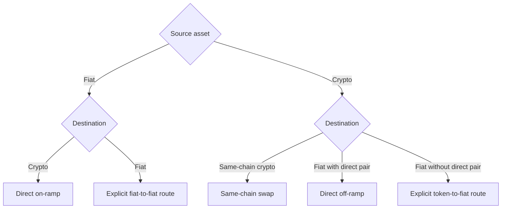

Before routing, collect:

- source asset and chain, or source fiat;
- exact-source or exact-destination mode;
- amount;
- destination asset or fiat currency;
- destination country;
- concrete recipient;
- optional routing preference.

If no live route exists, explain that it is currently unavailable. Do not
invent a corridor, split the payment, or silently change chains.
