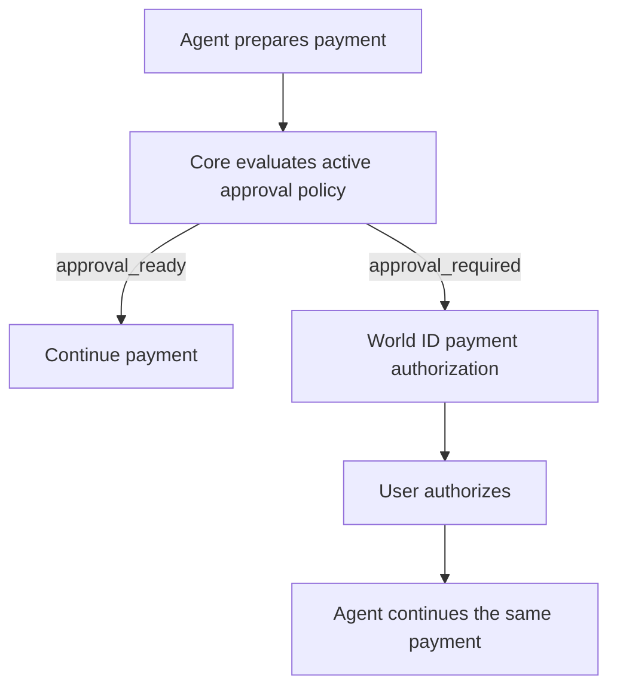

Connected-agent authorization grants capabilities. The account owner's
platform threshold contributes to the active approval policy, while Core's
returned payment status determines whether the payment may continue or needs
payment-specific World ID authorization.

Hosted spending grants are a separate wallet-funding permission. They do not
replace payment review or World ID approval and require a new explicit choice
for the current crypto-deposit instruction.

KYC controls market eligibility. AgentKit verifies the agent wallet and may
enable sponsored gas. Neither replaces the payment threshold or World ID
authorization.
