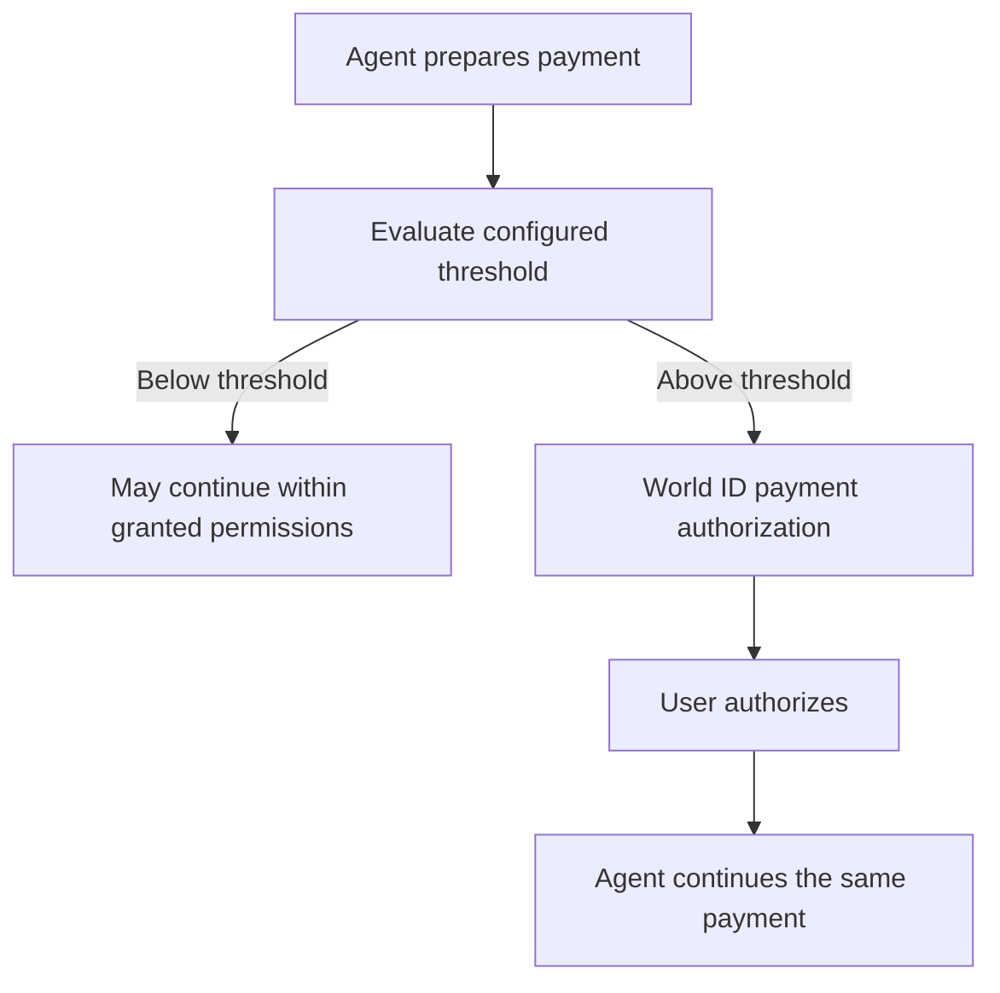

Connected-agent authorization grants capabilities. The account owner's
platform threshold controls whether a payment may proceed automatically or
requires payment-specific World ID authorization.

KYC controls market eligibility. AgentKit verifies the agent wallet and may
enable sponsored gas. Neither replaces the payment threshold or World ID
authorization.
