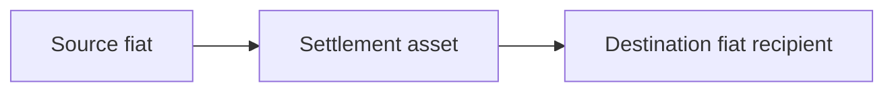

The agent must:

1. Discover relevant live on-ramp and off-ramp pairs.
2. Find one common active crypto asset on one supported chain.
3. Pass that asset explicitly as the route's intermediate asset.
4. Provide a concrete final fiat recipient.
5. Preserve exact-source or exact-destination intent.
6. Present both route steps before durable creation.

AgentBank opens and binds the downstream off-ramp first. The source on-ramp
sends its crypto output directly there. The payer funds only the upstream fiat
instruction—never fund the downstream step separately.
