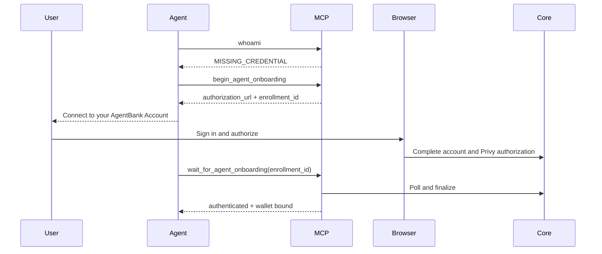

## What your agent should do

1. Call `whoami` when AgentBank work begins.
2. If it receives `MISSING_CREDENTIAL`, call `begin_agent_onboarding` once.
3. Show the returned authorization URL.
4. Immediately call `wait_for_agent_onboarding` with the same enrollment ID.
5. If polling times out while still pending, reuse that enrollment ID.
6. Verify `privy_authorized`, `wallet_bound`, and `authenticated`.
7. Check identity, scopes, account readiness, and wallets.

If an existing installation returns `UNAUTHENTICATED` because its session
expired, call `relogin` once and retry the original operation. Do not begin a
new onboarding flow for an expired session.

Credential-store errors such as `CREDENTIAL_PROTECTOR_LOCKED`,
`CREDENTIAL_STORE_CORRUPT`, or `CREDENTIAL_PROFILE_MISMATCH` require the
returned operating-system or profile remediation. Preserve the installation
instead of replacing it.

<Warning>
Never paste a private key, seed phrase, AgentBank token, Privy token,
authorization key, or World ID proof into chat or support.
</Warning>

## Disconnect an agent

`revoke_agent` invalidates the connected installation and clears its local
credential. It requires explicit user confirmation.

Hosted OAuth connections use a different setup and revocation path. See
[Remote MCP](/getting-started/hosted-oauth).
