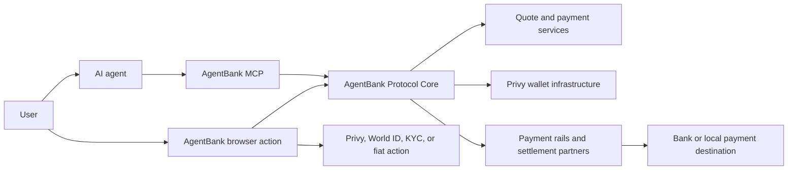

| Layer | Responsibility |
| --- | --- |
| User | Connect the account, set the autonomy threshold, and complete required browser actions |
| AI agent | Understand the request, call MCP tools, present material details, and track status |
| AgentBank MCP | Restore the local connected-agent credential and expose high-level tools and resources |
| Protocol Core | Enforce authorization, lock routes, issue instructions, verify execution, and store durable state |
| Privy | Provide the AgentBank wallet infrastructure |
| World ID / AgentKit | Provide payment-specific human authorization and verified-agent capabilities |
| KYC provider | Verify eligibility for gated fiat markets |
| Payment rails | Collect or deliver fiat for supported routes |

<Warning>
A successful on-chain receipt is not necessarily final payment completion.
Always use `get_payment` as the authoritative durable status.
</Warning>
