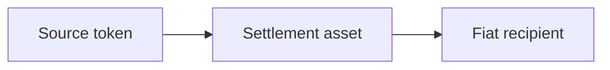

| Situation | Route |
| --- | --- |
| The source crypto has a live off-ramp pair | Use a direct off-ramp |
| The source token lacks a direct pair | Find a common settlement asset and build an explicit two-step route |
| No common active asset exists | Explain that the route is unavailable |

For the two-step route, the agent must select one active common crypto asset on
one supported chain and pass it explicitly to `estimate_payment`. It must not
silently switch chains, split the amount, or change exact-source versus
exact-destination intent.

The swap output is bound directly to the downstream off-ramp deposit. Never
send a second manual transfer to fund the downstream step.
