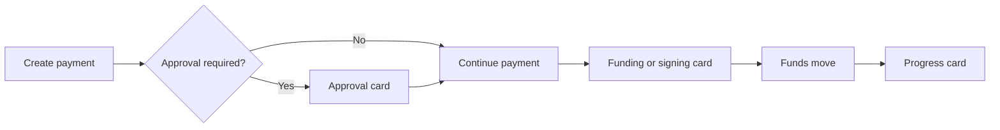

Hosted OAuth separates payment actions into cards so the user can approve and
fund through first-party AgentBank and Privy experiences.
Connect from [ChatGPT or Claude](/getting-started/hosted-oauth) to use this flow.

## Quote preview

`estimate_payment` provides a live preview before payment creation. Review the
source and destination amounts, fees, route, recipient outcome, and expiry.
The estimate is informational: it does not reserve a rate or move money.

## Payment journey

## Approval

When `create_payment` returns `approval_required`, call
`show_payment_approval` with that payment ID. Do not also paste the approval
URL unless the user asks for it or the card is unavailable.

## Payment plans

Review every payment and the totals before confirming a
[payment plan](/payments/payment-plans). After submission, use
`show_payment_plan_approval` to reopen the single World ID approval card when
approval is required. Each child payment retains its own funding instruction
and settlement status.

## Funding instruction

`continue_payment` displays the current funding card. Reopen a missed card
with `get_payment_instruction`; `get_payment` reads state but does not reopen
the card.

Fiat bank, QR, mobile-money, and payment-link instructions are completed
through the card. A crypto-deposit card can be funded manually or, after a new
explicit user choice, with a compatible spending grant.

`get_payment_link` retrieves a shareable public action link when one is
available for the payment. Use the returned link rather than constructing one.
Opening a card or link does not itself fund the payment. For collections from
another payer, see [Collect from a payer](/money-in/collect-from-a-payer).

## Swap signing

For hosted swaps, open the returned `transaction_signing_url`. The owner signs
through the first-party Privy page. A spending grant must not be used for a
swap.

## Progress

Call `get_payment` to read authoritative state. Before funds move, refer the
user to the existing funding card. After funds move, call
`show_payment_progress`. The funding card and progress card remain separate.

<Warning>
Showing or approving a payment is not wallet-funding authorization. Wait for a
new user response before using a spending grant for the current instruction.
</Warning>
