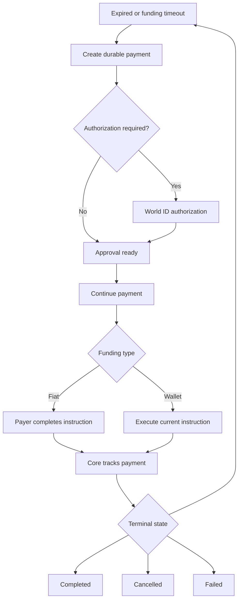

An estimate is temporary and has no ID. `create_payment` persists the request,
locks its route, and creates the authorization state. `continue_payment` opens
approved settlement steps and returns the current instruction.

`execute_payment_instruction` can execute only that current instruction through
the pinned wallet. `get_transaction_receipt` reports on-chain state, while
`get_payment` reports the authoritative aggregate payment state.

On hosted OAuth, approval and funding are displayed in dedicated cards. Local
crypto instructions can use `execute_payment_instruction`; hosted crypto
deposits require manual owner action or a separately confirmed spending grant,
and hosted swaps use the returned first-party signing URL.
